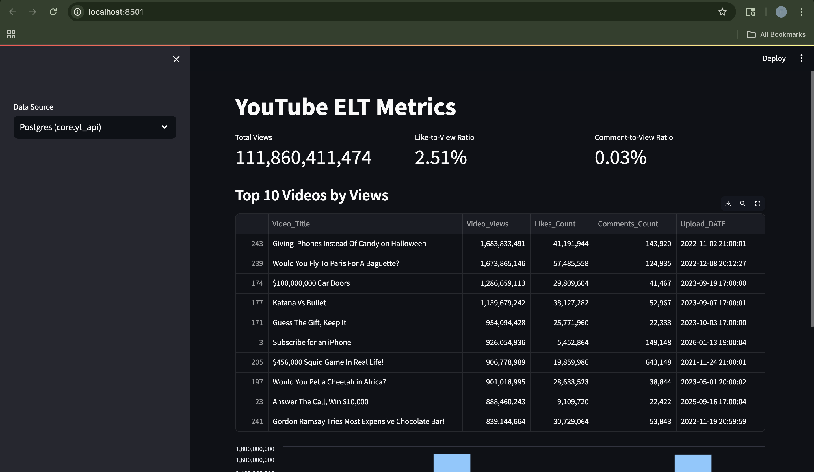

# YouTube ELT Pipeline

An end-to-end YouTube ELT pipeline with Airflow orchestration, Postgres storage, automated testing, data quality checks, and a Streamlit analytics dashboard.



## Overview
- Extracts YouTube video metadata and metrics via the YouTube Data API.
- Lands raw data in JSON.
- Loads and transforms into a Postgres data warehouse (staging + core).
- Runs data quality checks with Soda.
- Serves a Streamlit dashboard for quick insights.

## Tech Stack
- **Orchestration:** Apache Airflow (CeleryExecutor)
- **Languages:** Python, SQL
- **Storage:** Postgres
- **Data Quality:** Soda (soda-core-postgres)
- **Testing:** Pytest
- **CI/CD:** GitHub Actions (build, test, push Docker images)
- **Visualization:** Streamlit
- **Containerization:** Docker, Docker Compose

## Architecture
1. **Extract**
   - YouTube API → `data/YT_data_YYYY-MM-DD.json`
2. **Load**
   - JSON → Postgres `staging.yt_api`
3. **Transform**
   - Staging → `core.yt_api`
4. **Quality**
   - Soda checks against staging + core
5. **Visualize**
   - Streamlit dashboard from Postgres `core.yt_api`

## DAGs
- `produce_JSON`: Extracts and writes daily JSON
- `update_db`: Loads JSON into Postgres + transforms
- `data_quality`: Runs Soda checks

## Streamlit Dashboard
Run locally:
```bash
source venv/bin/activate
pip install -r requirements.txt
streamlit run streamlit_app.py
```

## Tests
```bash
pytest -v tests
```

## CI/CD (GitHub Actions)
- Builds and pushes Docker images on changes to `dockerfile` or `requirements.txt`
- Runs unit/integration tests on DAG and pipeline changes

## Notes
- Airflow connections and variables are managed via `.env`
- Postgres schemas: `staging` and `core`
